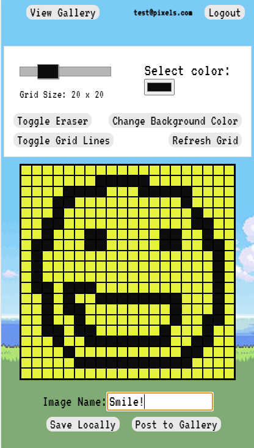
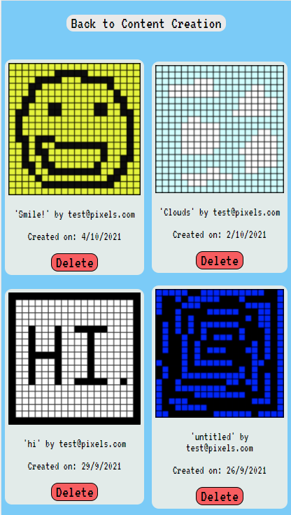

Pixel Share App

<strong>Test login account has been provided. Feel free to use it and enjoy the app!!</strong>

Features:
1)Create and share your pixel art online.
2)Save pixel art on your desktop as an image file.
3)Various options to create a perfect drawing.
<strong>4)Can be used on mobile as well!!</strong>
5)Change number of pixels.
6)See other user's content.

Details:
This project is made with React and Firebase.
Additional libraries include React-Router and Html2Canvas.

Live Site: https://rajhanspol.github.io/pixelShare 

 
Create your artwork with all the options avaliable. Name your art and click Post to Gallery or save image. 

 

 
View your image in the online gallery along with other user generated content. Save the image to desktop by right clicking and selecting Save Image.  

 

